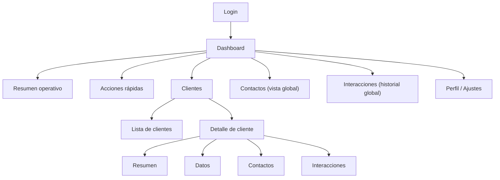

# Concepto de interfaz de usuario (UI Concept)

Este documento describe la propuesta funcional de la interfaz de usuario
del proyecto CRM Django. Su objetivo es definir las vistas principales del
sistema, los datos que se muestran en cada una de ellas y las acciones
disponibles para el usuario.

El contenido de este documento debe entenderse como una referencia
conceptual y funcional, no como un diseño visual definitivo.
La apariencia final, el diseño gráfico y la experiencia de usuario
podrán evolucionar conforme avance el desarrollo del frontend.

---

## Objetivo del UI Concept

El objetivo de esta propuesta de interfaz es:

- Facilitar la gestión de clientes y sus relaciones.
- Proporcionar una navegación clara y coherente.
- Reflejar el dominio del CRM definido en la documentación técnica.
- Servir como guía para el desarrollo del frontend y la integración con el backend.

La interfaz se apoya en una arquitectura API-first, donde el frontend
consume los datos expuestos por el backend mediante una API REST.

---

## Estructura general de navegación

La aplicación se organiza en torno a las siguientes vistas principales:

Esta estructura sitúa al cliente como elemento central del sistema,
siguiendo la lógica habitual de los sistemas CRM.

---

## Vista: Login

### Objetivo
Permitir la autenticación de los usuarios en el sistema.

### Contenido
- Campo de usuario o correo electrónico.
- Campo de contraseña.

### Acciones
- Iniciar sesión.
- (Futuro) Recuperación de contraseña.

### Consideraciones
Esta vista es de acceso previo al sistema y no requiere navegación adicional.

---

## Vista: Dashboard

El Dashboard actúa como punto de entrada principal tras la autenticación
y como centro operativo del sistema.

### Resumen operativo

#### Objetivo
Proporcionar una visión rápida del estado del CRM.

#### Información mostrada
- Número total de clientes.
- Últimas interacciones registradas.
- Clientes creados recientemente.

---

### Acciones rápidas

#### Objetivo
Permitir al usuario realizar las acciones más habituales sin navegar
por múltiples pantallas.

#### Acciones disponibles
- Crear nuevo cliente.
- Registrar nueva interacción.
- Acceder a la lista de clientes.
- Acceder al historial de interacciones.

---

## Vista: Clientes

### Lista de clientes

#### Objetivo
Visualizar y gestionar el conjunto de clientes registrados en el sistema.

#### Información mostrada
- Nombre del cliente.
- Tipo de cliente (persona o empresa).
- Correo electrónico.
- Teléfono.
- Fecha de creación.

#### Acciones
- Crear nuevo cliente.
- Buscar o filtrar clientes.
- Acceder al detalle de un cliente.
- Editar cliente.
- Eliminar cliente.

---

### Detalle de cliente

Esta vista constituye el núcleo funcional del CRM y centraliza toda la
información relevante sobre un cliente concreto.

#### Subvista: Resumen

##### Objetivo
Ofrecer una visión rápida del estado del cliente.

##### Información mostrada
- Datos principales del cliente.
- Última interacción registrada.
- Número de contactos asociados.
- Número total de interacciones.

---

#### Subvista: Datos

##### Objetivo
Mostrar y editar la información general del cliente.

##### Información mostrada
- Nombre.
- Tipo de cliente.
- Datos de contacto.
- Dirección u observaciones.

##### Acciones
- Editar datos del cliente.
- Eliminar cliente.

---

#### Subvista: Contactos

##### Objetivo
Gestionar las personas asociadas a un cliente.

##### Información mostrada
- Nombre del contacto.
- Correo electrónico.
- Teléfono.
- Cargo o rol.

##### Acciones
- Añadir nuevo contacto.
- Editar contacto.
- Eliminar contacto.

---

#### Subvista: Interacciones

##### Objetivo
Registrar y consultar el historial de comunicaciones con el cliente.

##### Información mostrada
- Tipo de interacción (llamada, correo, reunión, etc.).
- Fecha.
- Breve descripción.
- Contacto asociado (si existe).

##### Acciones
- Registrar nueva interacción.
- Editar interacción.
- Eliminar interacción.

---

## Vista: Contactos (vista global)

### Objetivo
Permitir la búsqueda y consulta de contactos de forma global, sin necesidad
de acceder a cada cliente individualmente.

### Información mostrada
- Nombre del contacto.
- Cliente asociado.
- Correo electrónico.
- Teléfono.

### Acciones
- Acceder al cliente del contacto.
- Editar contacto.

---

## Vista: Interacciones (historial global)

### Objetivo
Visualizar el conjunto de interacciones registradas en el sistema.

### Información mostrada
- Fecha.
- Tipo de interacción.
- Cliente.
- Contacto asociado.
- Usuario que registró la interacción.

### Acciones
- Filtrar por fecha o tipo.
- Acceder al detalle de la interacción.

---

## Vista: Perfil y ajustes

### Objetivo
Permitir al usuario gestionar su información personal y su sesión.

### Información mostrada
- Nombre del usuario.
- Correo electrónico.
- Empresa asociada.

### Acciones
- Cambiar contraseña.
- Cerrar sesión.

---

## Consideraciones finales

La propuesta de interfaz descrita en este documento está diseñada para
evolucionar junto con el backend. La estructura de vistas y acciones
podrá ajustarse durante la fase de integración frontend-backend, manteniendo
siempre la coherencia con el dominio del sistema.

Este documento no define aspectos visuales ni de diseño gráfico, centrándose
exclusivamente en la funcionalidad y organización de la interfaz.
